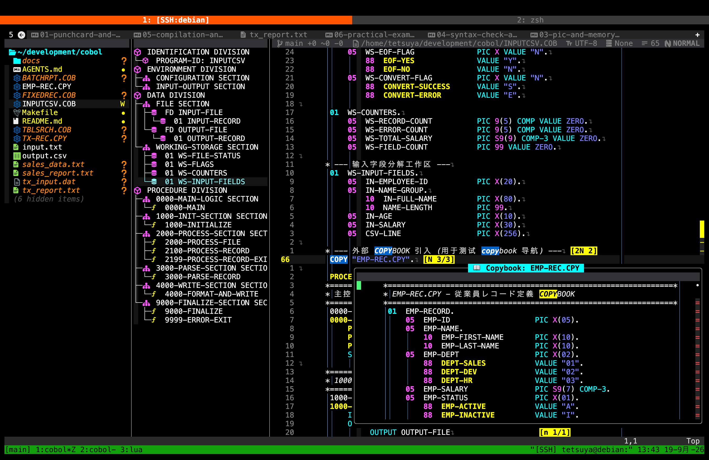

# cobol.nvim

COBOL editing support for Neovim, with a focus on fixed-format source code and a beginner-friendly workflow.

The plugin helps you read existing COBOL programs, understand their layout, find definitions and copybooks, inspect data records, and catch syntax errors while you work. It does not require a language server.

[简体中文](README.zh-CN.md) · [日本語](README.ja.md)



The screenshot shows the main workflow: the Aerial structure outline, fixed-format column guides, COBOL navigation, and a copybook preview in the editor.

## Who is it for?

`cobol.nvim` is useful for beginners learning fixed-format COBOL, developers maintaining `.cob`, `.cbl`, or `.cobol` programs, and projects that use copybooks and traditional Division/Section/Paragraph structure.

The core features work without Aerial. Aerial is an optional dependency for a sidebar outline.

## Features

| Area | What it provides | Why it helps |
| --- | --- | --- |
| Fixed-format layout | Guides for columns 7, 8, 12, and 73; overflow highlighting; column jumps | Makes COBOL's source areas visible while you edit |
| Structure and navigation | Winbar breadcrumbs, folding, `gd`, `gf`, and `K` | Helps you move through Divisions, paragraphs, fields, and copybooks |
| Data layout | PIC and record-size estimates, including `OCCURS` and `REDEFINES` | Gives beginners a practical view of record storage |
| Diagnostics | Asynchronous `cobc -fsyntax-only` checks and Quickfix integration | Finds syntax errors without blocking the editor |
| Editing helpers | Comment toggle, smart Tab, reserved-word case formatting | Reduces repetitive work in fixed-format source |
| Optional outline | Aerial backend for COBOL | Provides a searchable sidebar tree |

## Requirements

- Neovim 0.10 or newer.
- GnuCOBOL (`cobc`) is optional. Install it to use compiler diagnostics.
- Aerial is optional. Install it only if you want the outline sidebar.

## Installation

With [lazy.nvim](https://github.com/folke/lazy.nvim):

```lua
{
  "iamcheyan/cobol.nvim",
  ft = { "cobol", "cbl", "cob" },
  opts = {},
}
```

To enable the optional Aerial backend:

```lua
{
  "stevearc/aerial.nvim",
  optional = true,
  opts = function(_, opts)
    opts.backends = vim.tbl_deep_extend("force", opts.backends or {}, {
      cobol = { "cobol" },
    })
  end,
}
```

The plugin does not install `cobc` for you. Install GnuCOBOL separately with your operating system's package manager or build instructions.

## Configuration

The defaults are suitable for a small project. A project-specific setup can look like this:

```lua
{
  "iamcheyan/cobol.nvim",
  ft = { "cobol", "cbl", "cob" },
  opts = {
    project_root = vim.fn.expand("~/src/my-cobol-project"),
    copybook_paths = { ".", "./cpy", "./copybooks", "./include" },
    cobc_command = "cobc",
    cobc_extra_args = {},
    source_format = "auto",
    folding = { enable = true },
    diagnostics = { enable = true, debounce_ms = 600 },
  },
}
```

`project_root` and `copybook_paths` are used by copybook navigation and diagnostics. `source_format` accepts `auto`, `fixed`, or `free`. Without a project root, the plugin uses the current file's directory as a fallback.

## A first workflow

1. Open a COBOL source file and check the column guides. In fixed-format code, column 7 is the indicator area, columns 8–11 are Area A, columns 12–72 are Area B, and column 73 starts the identification area.
2. Use `gd` on a paragraph or data name. Use `gf` on a `COPY` statement and `K` to preview a paragraph or copybook.
3. If Aerial is installed, press `<leader>cs` to open the structure outline.
4. Place the cursor on a level-01 record or field and press `<leader>cr` to inspect the estimated layout.
5. Save the file or press `<leader>cl` to run a syntax check with GnuCOBOL.
6. Use `za`, `zc`, and `zo` to fold or unfold the current COBOL structure.

## Fixed-format editing

Toggle the guide with `<leader>uc` or `:CobolGuideToggle`. The plugin highlights text beyond column 72, where fixed-format compilers normally ignore source text.

| Key | Destination |
| --- | --- |
| `g7` | Indicator column |
| `g8` | Area A |
| `g12` | Area B |
| `g73` | Identification area |

At the start of a line, Insert-mode `<Tab>` moves input toward Area A or Area B instead of inserting arbitrary indentation. `<leader>c*` and `:CobolToggleComment` add or remove a fixed-format comment marker in column 7. Visual selections are supported.

## Navigation and outline

- `gd` / `:CobolGotoDef`: jump to a paragraph, data definition, or copybook.
- `gf` / `:CobolGotoCopybook`: open the copybook under the cursor.
- `K` / `:CobolPreview`: preview a paragraph or copybook in a floating window.
- `<C-o>`: return through Neovim's jump list.
- `<leader>cs`: toggle the optional Aerial outline.

The bundled Aerial backend recognizes COBOL Divisions, Sections, Paragraphs, file descriptions, and level-01 records. Without Aerial, all other navigation features remain available.

## Folding and formatting

The plugin provides native folding for Divisions, Sections, Paragraphs, and data records: `za` toggles the current fold, `zc` closes it, and `zo` opens it.

`:CobolFormatCase` formats the current line, a Visual selection, or the whole buffer. It changes recognized COBOL reserved words while preserving strings, comments, and user-defined names. It is a conservative case formatter, not a full source reformatter.

## PIC and record calculator

`<leader>cr` or `:CobolCalcRecord` opens a layout table for the current record or field. It estimates sizes for common `DISPLAY`, `COMP`/`BINARY`, `COMP-3`/`PACKED-DECIMAL`, `OCCURS`, and `REDEFINES` declarations.

These values are estimates based on common GnuCOBOL and platform conventions. They are useful for learning and review, but the compiler remains the authority for an application's actual ABI and storage layout.

## Diagnostics

`cobol.nvim` can run:

```text
cobc -fsyntax-only ...
```

The check runs asynchronously after saving, after text changes with a debounce, or when leaving Insert mode. `<leader>cl` or `:CobolLint` runs it immediately, and `<leader>cq` or `:CobolQuickfix` opens the resulting Quickfix list. Use `:CobolDiagnosticsToggle` to enable or disable automatic diagnostics.

Unsaved buffer contents are passed to the compiler through standard input when possible. If `cobc` is not installed, the plugin does not crash; install GnuCOBOL or set `cobc_command` to the correct executable.

## Commands

| Command | Purpose |
| --- | --- |
| `:CobolGuideToggle` | Toggle column guides and the winbar |
| `:CobolGuideEnable` / `:CobolGuideDisable` | Enable or disable the guides |
| `:CobolGotoDef` | Jump to a definition |
| `:CobolGotoCopybook` | Open a copybook |
| `:CobolPreview` | Preview a paragraph or copybook |
| `:CobolCalcRecord` | Show the record layout estimate |
| `:CobolFormatCase` | Format recognized reserved words |
| `:CobolLint` | Run the GnuCOBOL syntax check |
| `:CobolQuickfix` | Open the diagnostics Quickfix list |
| `:CobolDiagnosticsToggle` | Toggle automatic diagnostics |
| `:CobolToggleComment` | Toggle a fixed-format comment |

## Practice repository

The companion repository [iamcheyan/cobol](https://github.com/iamcheyan/cobol) is a small, runnable COBOL workshop. It is not required by the plugin, but it provides examples for practicing every feature described here.

```bash
git clone https://github.com/iamcheyan/cobol.git ~/cobol-practice
cd ~/cobol-practice
make check
nvim INPUTCSV.COB
```

The lessons cover fixed-format source, copybooks, PIC clauses and storage, `REDEFINES`, `OCCURS`, `SEARCH ALL`, and control-break reporting. Read `docs/01` through `docs/07` in order. The final lab maps the examples to the plugin's navigation, calculator, folding, formatting, and diagnostics commands.

## Troubleshooting

- **No column guide:** confirm that `:set filetype?` reports `cobol`.
- **No outline:** Aerial is optional; install it and add the configuration shown above.
- **No diagnostics:** run `:echo executable('cobc')` and install GnuCOBOL or correct `cobc_command`.
- **Copybook not found:** set `project_root` and include the copybook directories in `copybook_paths`.
- **Unexpected layout size:** treat calculator output as an estimate and verify the declaration with the compiler and platform documentation.

## Development

Run the test suite from the repository root:

```bash
./scripts/test.sh
```

The Aerial-specific test is skipped when Aerial is not installed; the core tests do not require it.

## License

MIT. See [LICENSE](LICENSE).
