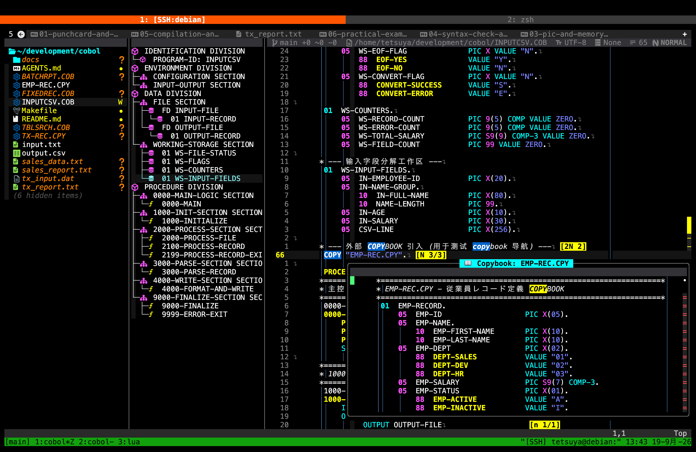

# cobol.nvim

面向 Neovim 的 COBOL 编辑支持插件，重点服务于固定格式 COBOL 和初学者的学习流程。

它帮助你阅读程序、理解源码列布局、查找段落和数据定义、打开 Copybook、查看数据记录布局，并在编辑过程中发现语法错误。插件不依赖语言服务器。

[English](README.md) · [日本語](README.ja.md)



图中展示了插件的主要工作流：Aerial 结构大纲、固定格式列标尺、COBOL 导航，以及编辑器中的 Copybook 预览。Aerial 是一个 Neovim 代码结构大纲插件，用侧边栏显示可搜索的 Outline。

## 适合谁使用？

`cobol.nvim` 适合正在学习固定格式 COBOL 的初学者、维护 `.cob`、`.cbl` 或 `.cobol` 程序的开发者，以及使用 Copybook 和 Division、Section、Paragraph 结构的项目。

核心功能不依赖 Aerial。Aerial 是可选的 Neovim 代码结构大纲插件；`cobol.nvim` 提供供它使用的 COBOL 专用 backend。

## 功能概览

| 方向 | 提供的功能 | 对用户的帮助 |
| --- | --- | --- |
| 固定格式布局 | 第 7、8、12、73 列标尺、越界高亮、列跳转 | 直观看到 COBOL 各个源码区域 |
| 结构与导航 | Winbar 面包屑、折叠、`gd`、`gf`、`K` | 快速浏览 Division、段落、字段和递归引用的 Copybook |
| 数据布局 | PIC 和记录大小估算，支持 `OCCURS`、`REDEFINES` | 帮助理解记录在内存中的组织方式 |
| 代码补全 | COBOL 关键字、动词、子句、代码片段、数据名、段落和 Copybook | 减少重复输入，也帮助你熟悉 COBOL 的词汇和程序结构 |
| 上下文信息 | 格式、源码区域、面包屑、当前 PIC 和记录大小 | 移动光标时始终看到最重要的 COBOL 上下文 |
| 诊断 | 异步执行 `cobc -fsyntax-only`，集成 Quickfix | 编辑时发现语法错误，不阻塞界面 |
| 编辑辅助 | 注释切换、智能 Tab、保留字大小写格式化 | 减少固定格式代码中的重复操作 |
| 可选大纲 | Aerial（Neovim 代码结构侧边栏）和 COBOL backend | 提供可搜索的程序结构树 |

## 环境要求

- Neovim 0.10 或更高版本；
- [blink.cmp](https://github.com/saghen/blink.cmp) 是可选依赖。安装后会启用内置的 COBOL 补全源；
- GnuCOBOL（`cobc`）是可选的，安装后才能使用编译器诊断；
- Aerial 是可选的。它是 Neovim 的代码结构/Outline 侧边栏插件，只在需要大纲视图时安装。

## 安装

使用 [lazy.nvim](https://github.com/folke/lazy.nvim)：

```lua
{
  "iamcheyan/cobol.nvim",
  ft = { "cobol", "cbl", "cob" },
  opts = {},
}
```

如需使用可选的 Aerial 代码结构侧边栏，请安装 Aerial 并启用 COBOL backend：

```lua
{
  "stevearc/aerial.nvim",
  optional = true,
  opts = function(_, opts)
    opts.backends = vim.tbl_deep_extend("force", opts.backends or {}, {
      cobol = { "cobol" },
    })
  end,
}
```

插件不会自动安装 `cobc`，请单独安装 GnuCOBOL。

## 配置

```lua
{
  "iamcheyan/cobol.nvim",
  ft = { "cobol", "cbl", "cob" },
  opts = {
    project_root = vim.fn.expand("~/src/my-cobol-project"),
    copybook_paths = { ".", "./cpy", "./copybooks", "./include" },
    cobc_command = "cobc",
    cobc_extra_args = {},
    source_format = "auto",
    folding = { enable = true },
    diagnostics = { enable = true, debounce_ms = 600 },
  },
}
```

`project_root` 和 `copybook_paths` 用于 Copybook 导航和诊断。`source_format` 可以设置为 `auto`、`fixed` 或 `free`。没有设置项目根目录时，会使用当前文件目录。

## GnuCOBOL 固定格式项目

在项目根目录创建 `.cobol.json`。插件会向上查找该文件、Makefile 或 Git 根目录；项目配置中的相对路径都从项目根目录解析。

```json
{
  "source_format": "fixed",
  "dialect": "default",
  "compiler": "cobc",
  "copybook_paths": ["copy", "cpy"],
  "compiler_args": ["-Wall"],
  "commands": {
    "build": ["make", "build"],
    "run": ["make", "run"],
    "test": ["make", "test"]
  }
}
```

- `source_format`：`fixed`、`free` 或 `auto`。GnuCOBOL 固定格式项目建议明确写 `fixed`。
- `dialect`：传给 GnuCOBOL 的 `-std=` 值。
- `compiler`：编译器可执行文件名或路径，默认 `cobc`。
- `copybook_paths`：Copybook 目录列表；每个目录作为单独的 `-I` 参数，也用于导航。
- `warnings`：GnuCOBOL 警告选项列表，例如 `["all", "no-obsolete"]`，会同时用于诊断和构建。
- `compiler_args`：额外编译参数。
- `commands`：可选的 build/run/test 命令参数数组。每项是独立参数，不经过 shell。省略时插件会识别 Makefile 的 `build`/`all`、`run`、`test`/`check` 目标。

没有 `.cobol.json` 时会提示一次，并回退到 Neovim 插件配置与默认 GnuCOBOL 参数；配置格式错误时也会给出原因并回退。

单文件项目没有 Makefile 时，`:CobolBuild` 用配置的编译器构建，`:CobolRun` 构建后运行，`:CobolTest` 执行语法检查。多源文件项目请提供 Makefile 或显式命令，避免插件猜测链接方式。项目命令读取磁盘文件，运行前请保存当前缓冲区。

若 Makefile 有构建规则但没有 `run` 目标，请在 Makefile 添加 `run`，或在配置中设置 `commands.run`；插件会提示缺少运行入口，不会猜测要执行哪个程序。

## 第一次使用建议

1. 打开 COBOL 源文件并观察列标尺。固定格式中，第 7 列是指示区，第 8–11 列是 Area A，第 12–72 列是 Area B，第 73 列开始是标识区。
2. 在段落名或数据名上按 `gd`；在 `COPY` 语句上按 `gf`，按 `K` 预览段落或 Copybook。
3. 安装可选的 Aerial Outline 侧边栏后，按 `<leader>cs` 打开结构大纲。
4. 将光标放在 01 级记录或字段上，按 `<leader>cr` 查看记录布局估算。
5. 保存文件，或按 `<leader>cl` 使用 GnuCOBOL 执行语法检查。
6. 使用 `za`、`zc`、`zo` 折叠或展开当前结构。

## 固定格式、导航与折叠

固定格式缩进根据 Area A / Area B、数据级别和常见结束语句调整缩进，并避免程序文本越过第 72 列。可用 `==` 触发当前行缩进；Normal 模式用 `gg=G` 整理整个文件，Visual 模式用 `=` 整理选区。带序号列的行会跳过自动缩进。

使用 `<leader>uc` 或 `:CobolGuideToggle` 切换列标尺。第 72 列之后的文本会被高亮，因为固定格式编译器通常会忽略它。

标尺虚拟文字使用 `hl_mode = "combine"`，保留主题的 `CursorColumn` 和 `CursorLine` 背景；因此第 7、8、12、73 列与光标重合时，整条竖线仍然可见，不覆盖源码字符。

| 快捷键 | 作用 |
| --- | --- |
| `g7` / `g8` / `g12` / `g73` | 跳到指示列、Area A、Area B、标识区 |
| `gd` / `:CobolGotoDef` | 搜索当前文件及递归引用的 Copybook 定义；重名时选择目标 |
| `gf` / `:CobolGotoCopybook` | 打开 Copybook；多个同名文件时选择路径 |
| `K` / `:CobolPreview` | 浮动窗口预览定义或 Copybook 来源 |
| `<C-o>` | 通过 Neovim 跳转列表返回 |
| `<leader>cs` | 切换可选的 Aerial Outline 侧边栏 |
| `za` / `zc` / `zo` | 切换、关闭、打开当前折叠 |

跨文件跳转后按 `Ctrl-o` 返回，按 `Ctrl-i` 再次前进。Copybook 必须位于搜索目录并由源文件的 `COPY name.` 引用；递归 `COPY` 和 `COPY ... REPLACING` 也能定位符号。搜索路径和编译参数统一来自项目配置。

插件自带的 Aerial backend 可以识别 Division、Section、Paragraph、文件描述和 01 级记录；Aerial 会把这些符号显示在可搜索的 Neovim 侧边栏中。不安装 Aerial 时，其他导航功能仍然可用。

## 代码补全

安装 `blink.cmp` 后，插件会在 `cobol`、`cbl` 和 `cob` 文件中自动注册 COBOL 补全源，不需要 COBOL 语言服务器。

补全内容包括常用 COBOL 动词和子句、可展开的代码片段（例如 `IF ... END-IF` 和 `PERFORM ... END-PERFORM`）、当前文件中声明的数据名，以及 `COPY` 引用的 Copybook 中的符号。补全不区分大小写，输入 `PER`、`WS-` 或 `COPY` 这样的前缀即可看到候选项。

`blink.cmp` 只是可选的编辑辅助功能；即使不安装它，标尺、导航、计算器、折叠、格式化和诊断功能仍然可用。

在行首或前导空白处，Insert 模式的 `<Tab>` 会自动靠近 Area A 或 Area B。`<leader>c*` 和 `:CobolToggleComment` 会按源格式切换注释：固定格式在第 7 列添加或移除 `*`，自由格式使用 `*>`，也支持 Visual 选区。

Fixed-format 中，Insert 模式的 `<Tab>` 依次跳到第 7、8、12 列；从第 12 列起插入普通 `shiftwidth` 缩进。`<S-Tab>` 按相反方向返回，且不删除源代码。完整规则见[固定格式 Tab 说明](docs/FIXED_FORMAT_TAB.md)。

## 格式化与 PIC 计算器

`:CobolFormatCase` 可以格式化当前行、Visual 选区或整个缓冲区。它只修改识别出的 COBOL 保留字，会保留字符串、注释和用户自定义名称。

`<leader>cr` 或 `:CobolCalcRecord` 会打开记录布局表，估算 `DISPLAY`、`COMP`/`BINARY`、`COMP-3`/`PACKED-DECIMAL`、`OCCURS` 和 `REDEFINES`。这些数值基于常见约定，只适合学习和检查；实际 ABI 和存储布局应以编译器和平台文档为准。

## 诊断

插件可以异步执行：

```text
cobc -fsyntax-only ...
```

保存文件、文本修改后的防抖时间到达，或离开 Insert 模式时会检查。`<leader>cl` / `:CobolLint` 立即检查，`<leader>cq` / `:CobolQuickfix` 打开 Quickfix，`:CobolDiagnosticsToggle` 切换自动诊断。

如果没有安装 `cobc`，插件不会崩溃。请安装 GnuCOBOL，或将 `cobc_command` 设置为正确的可执行文件。

## 命令

| 命令 | 作用 |
| --- | --- |
| `:CobolGuideToggle` / `:CobolGuideEnable` / `:CobolGuideDisable` | 切换、开启或关闭列标尺和 Winbar |
| `:CobolGotoDef` / `:CobolGotoCopybook` / `:CobolPreview` | 定义跳转、打开 Copybook、预览内容 |
| `:CobolCalcRecord` | 显示记录布局估算 |
| `:CobolFormatCase` | 格式化识别出的保留字 |
| `:CobolLint` / `:CobolQuickfix` | 执行诊断、打开 Quickfix |
| `:CobolDiagnosticsToggle` | 切换自动诊断 |
| `:CobolToggleComment` | 切换固定格式注释 |
| `:CobolBuild` / `:CobolRun` / `:CobolTest` | 构建、运行或检查当前项目 |

## 配套练习仓库

[iamcheyan/cobol](https://github.com/iamcheyan/cobol) 是一个小型、可运行的 COBOL 练习项目。它不是插件依赖，但提供了练习这里所有功能的示例。

```bash
git clone https://github.com/iamcheyan/cobol.git ~/cobol-practice
cd ~/cobol-practice
make check
nvim INPUTCSV.COB
```

课程覆盖固定格式源码、Copybook、PIC 与存储、`REDEFINES`、`OCCURS`、`SEARCH ALL` 和控制中断报表。建议按 `docs/01` 到 `docs/07` 顺序阅读；最后一课会把示例映射到插件的导航、计算器、折叠、格式化和诊断命令。

## 常见问题

- **没有列标尺：** 检查 `:set filetype?` 是否显示 `cobol`。
- **没有大纲：** 侧边栏由可选的 Aerial Neovim 插件提供，请安装它并加入上面的配置。
- **没有编译器诊断：** 运行 `:echo executable('cobc')`，安装 GnuCOBOL 或修正 `cobc_command`。
- **找不到 Copybook：** 设置 `project_root`，并将目录加入 `copybook_paths`。
- **布局大小不同：** 计算器结果只是估算值，请用编译器和平台文档确认。

## 开发与许可证

```bash
./scripts/test.sh
```

未安装 Aerial 时，Aerial 专项测试会跳过；其他核心测试不依赖 Aerial。MIT，见 [LICENSE](LICENSE)。

完整的已完成与计划中增强项见 [docs/ENHANCEMENTS.md](docs/ENHANCEMENTS.md)。
